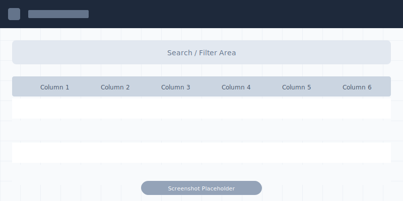

# My Bits View

The My Bits view is the home page for the Field Sales role, displaying all bits currently assigned to you.

!!! info "Role Availability"
    This view is available to: Field Sales

## Overview

The My Bits view shows your assigned bit inventory with quick access to billing and transfer functions.

## Quick Action Buttons

| Button | Function |
|--------|----------|
| **Find Bits** | Go to Find Bits view |
| **eBilling Workbench** | Go to eBilling Workbench view |
| **eTransfer Tickets** | Go to eTransfer Tickets view |
| **Bit Order** | Submit a new bit order |

## Scanning Options

Three scan options are available below the Active Location:

| Scan Option | Desktop | Mobile/iPad |
|-------------|---------|-------------|
| **Scan Bit Serial No** | Enter serial number | Scan barcode |
| **Scan for Active eBill Tickets** | Enter serial number | Scan QR code |
| **Scan Go SR Ticket #** | Enter ticket number | Scan QR code |

## Table Features

### Sorting

=== "Desktop/iPad"
    
    Click column headers to sort:
    1. Click to the left of the funnel icon
    2. Sort arrows appear
    3. Click up/down to sort

=== "Mobile"
    
    Use the Sort Order button:
    1. Tap **Sort Order**
    2. Choose sort options
    3. Tap **Sort** or **Sort and Save Sort Order**

### Filtering

=== "Desktop/iPad"
    
    Click the funnel icon in column headers to filter by specific values.

=== "Mobile"
    
    Only **EBILLING** and **SALES PERSON** filters are available on mobile.

## Viewing Bit Details

Click any row to open the **Bit Details** page for that bit.

## Common Tasks

| Task | Description |
|------|-------------|
| Submit bit order | Request bits from inventory |
| Send to another rep | Transfer bits to another salesperson |
| Consign a bit | Set up consignment |
| Create delivery ticket | Start the billing process |
| Add bit to ticket | Add bits to existing tickets |

## Related Documentation

- [Field Sales Role](../roles/field-sales.md)
- [eBilling Workbench View](ebilling-workbench.md)
- [eTransfer Tickets View](etransfer-tickets.md)
- [Searching and Filtering](../features/search-filter.md)
